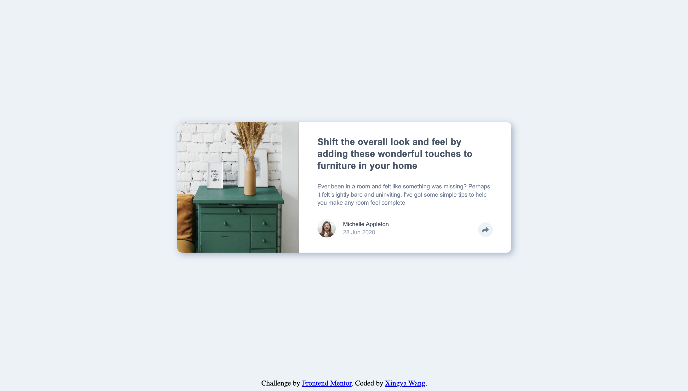

# Frontend Mentor - Article preview component solution

This is a solution to the [Article preview component challenge on Frontend Mentor](https://www.frontendmentor.io/challenges/article-preview-component-dYBN_pYFT). Frontend Mentor challenges help you improve your coding skills by building realistic projects. 

## Table of contents

- [Overview](#overview)
  - [The challenge](#the-challenge)
  - [Screenshot](#screenshot)
  - [Links](#links)
- [My process](#my-process)
  - [Built with](#built-with)
  - [What I learned](#what-i-learned)
- [Author](#author)
- [Acknowledgments](#acknowledgments)

## Overview

### The challenge

Users should be able to:

- View the optimal layout for the component depending on their device's screen size
- See the social media share links when they click the share icon

### Screenshot

### Links

- Solution URL: [GitHub](https://github.com/frontend-mentor-projects-repo/article-preview-component-main)
- Live Site URL: [Live Site](https://frontend-mentor-projects-repo.github.io/article-preview-component-main)

## My process

### Built with

- Semantic HTML5 markup
- CSS custom properties
- Flexbox
- Vanilla Javascript

### What I learned

I learned to used the `z-index`. But tbh I don't really like this challenge -- it's very hard to make the pop-over but it doesn't have much to do with practicing JavaScript (so not sure what is the point of having this challenge as an intro challenge on the JavaScript learning path.)

## Author

- GitHub - [@wxyzz22](https://github.com/wxyzz22)
- Frontend Mentor - [@wxyzz22](https://www.frontendmentor.io/home)
- LinkedIn - [Xingya Wang](https://www.linkedin.com/in/xingya-wang/)

## Acknowledgments

Special thanks to my mentor [@HarryLyons](https://github.com/GregLyons) for guidance and advice. And thanks for ChatGPT for saving my time searching on Google.